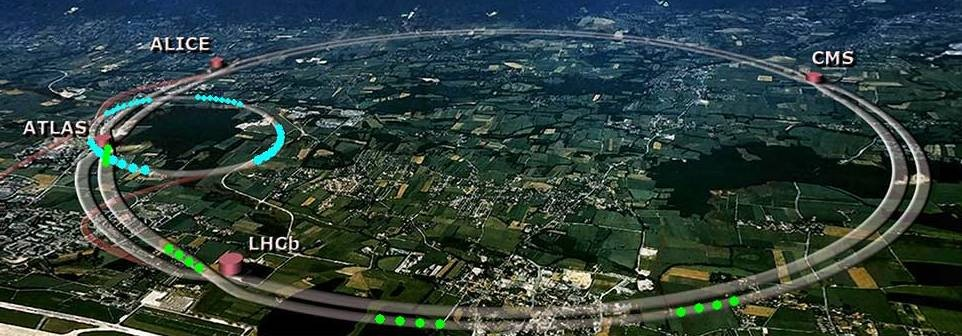
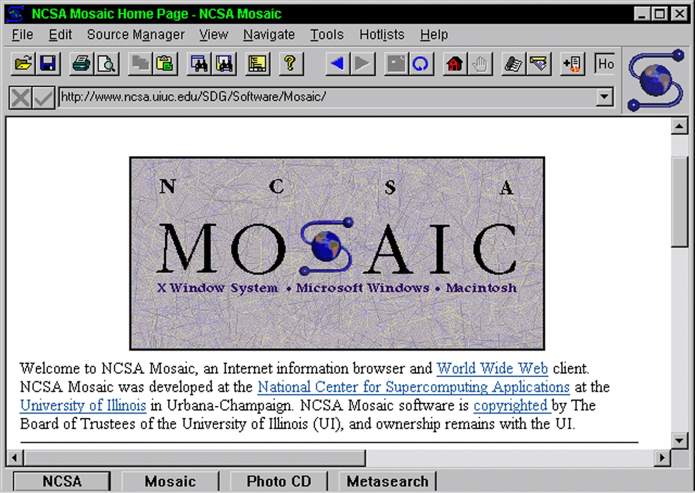
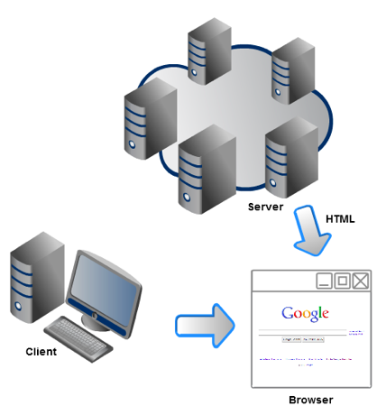
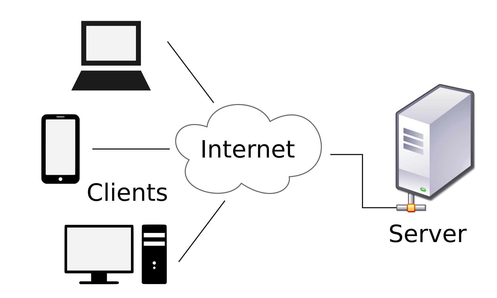

### Class 1: InstallFest

* Get to know your classmates, instructors, and staff members.
* Explain the structure of the course and tools that will be used.
* Discuss the benchmarks for assessments in terms of class participation, homework, and unit projects.
* Identify common issues that might arise and solutions that will be used during the course.
* Practice programmatic thinking.

---

### Agenda

| Timing | Topic |
| --- | --- |
| 25 min | Opening & Introductions |
| 15 min | The language of the web |
| 15 min | How the internet works |
| 5 min | Break |
| 30 min | Install All The Things! |
| 10 min | Break |
| 60 min | Exercise: Thinking Like a Programmer |
| 20 min | Class Information, Final Questions & Exit Tickets |

---

## Instructors

--

## Mike
- [mrfinneran@gmail.com](mrfinneran@gmail.com)

--

## Ray Haarstick
  - [ray@relevant.us](ray@relevant.us)

---

## Ice Breaker
Write the directions to making a peanut butter and jelly sandwich on the table in front of you.

---
## Disclaimer

Note:

Disclaimer - This class will not be heavy in traditional computer science (theory,
history, etc); we are primarily concerned with the practical. We want you to be able
to write programs in JavaScript. Today is an exception to that rule -- in order to
build context, I am going to delve a bit into history, but it will be
fun I promise!

---

### The Language of the Web

--

### ARPANET

- Research Project funded by government agency DARPA (Defense Advanced Research Projects Agency)
- First connection in 1969
- Used for sending information: email, files
- Connected military bases and research universities

--

- Over time, more people added to the net: large business, smaller universities, etc
- Other, smaller nets based on similar tech also began to emerge
- These networks were connected to ARPANET, creating an "inter" net.

--

### _Sir_ Tim Berners-Lee

- 1989 - 1990 Drafted the proposal for the WWW
- He wanted a way to link the information in the disparate CERN
computers

--

### CERN

--

http://info.cern.ch/hypertext/WWW/TheProject.html

--

### High-Performance Computing and Communications Act of 1991

- Browser created with grant money from the bill, drafted by Al Gore.
- This is when the internet began to take off outside of government/academia

--

### Al Gore

--

- Marc Andreesen and other key employees left Mosaic to start Netscape

--

### Brendan Eich

- Debate within Netscape about whether or not the browser needed a new Language
- Netscape had a big deal in the works with Sun Microsystems, creator of Java
- Created "LiveScript" in 10 days

--

## +

- Eich was told the language needed to "look like" java
- His primary inspiration came from a functional, mostly academic language called
Scheme
- This led to JavaScript being able to use both of the two primary programming
paradigms: Object Oriented Programming and Functional Programming

--

### Object Oriented Programming

- Everything is an Object
- Objects have attributes and methods

--

--

### Functional Programming

- Everything is a function
- Mathematical
- Comes from a type of math called Lambda Calculus, hence the symbol in Scheme's
logo

--

- To do interesting things, we combine and compose functions

--

- Name was changed to JS because of the deal with Sun Microsystems; primarily
a marketing/branding decision

--

### ECMAScript

- Standard for the language to formalize what JavaScript was in 1996
- Needed because more browsers were being created with different implementations
of JavaScript
- Rivals, Java for the browser, ActionScript, Flash existed, but fell off and
never reached the popularity of JavaScript

---

##How The Internet Works

--

###Intro To HTML

* HyperText Markup Language
* Been around since the early 90's
* Started as a way for researchers to use and share documents and first version had 18 tags
* Gives meaning (and a little visual structure) to content
* Not a programming langage

--

##Intro To CSS

* Cascading Style Sheets
* Been around since the mid 90's
* Handles all of the visual aspects to a webpage and removed the need for HTML to handle this
* Made up of a series of centralized rules that can override each other
* Not a programming language

--

##Intro To JavaScript

* Adds behavior to webpages and applications
* Been around since the mid 90's
* C & Java inspired syntax, and is a prototype based language with first class functions
* Is not related to the Java server side language
* Is the only real programming language available for the browser
### Awesome Modern JavaScript Uses

--

##Timeline

---

#### Traditional Sites

- https://isl.co/
- http://thestlbrowns.com/

#### Web Applications

- https://www.mapbox.com/studio/
- https://www.consumerbarometer.com/

---

### It's No Longer Limited to the Browser

- Mobile Applications (via React Native, Phonegap, Cordova, etc)
- Wearables (via Embedded JS Engines)
- *On your command line/terminal (via Node)*

---

## Break

---

## Install All The Things

--

### Slack

We'll be using Slack to register attendance and communicate during class.

* Visit the following [site](https://slack.com/downloads) to download the application.
* Sign up using your email and join our class Slack channel.
* Upload a profile picture to Slack.

--

### Git & GitHub

- Code "versioning" Software
- Collaborate and keep track of code

--

### Sublime Text

- Text Editor

--

### Chrome 

- Web Browser

--

### JSBIN 

- Code Playground

--

#### __WARNING:__ Problems getting your environment configured come with the territory.

---

## Break

---

## Think like a programmer

- Drawing exercise

--
## Think like a programmer

---

## HTML and CSS Review

- Light Switch Example

- https://jsbin.com/tidiru/edit

---

## Psuedo Code for Stop Light

- Light Switch psuedo code

- https://jsbin.com/tidiru/edit

---

## HTML and CSS Review

- Stoplight Example

- https://jsbin.com/luseso/edit

---

## Psuedo Code for Stop Light

- Stoplight psuedo code

- https://jsbin.com/luseso/edit

---

## [Exit Ticket!](http://goo.gl/forms/KzVZ9fuo2YYw5WIB3)

---

# Goodnight :-)
